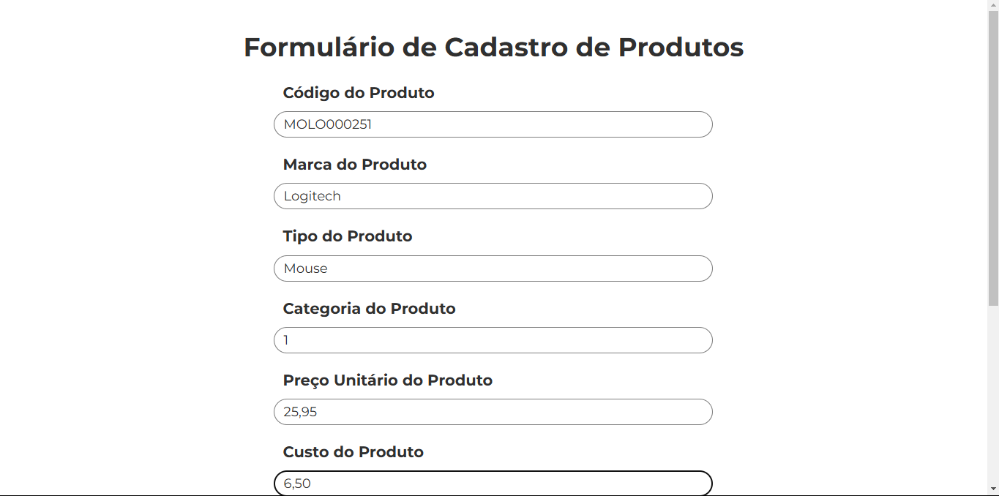

# Automação de Tarefas e Criação de Bots

Este projeto tem como objetivo automatizar tarefas repetitivas e criar bots que podem facilitar o trabalho do dia a dia.

Prévia do cadastro de produtos realizado pelo bot.

## Principais Resultados

- **Automação do Cadastro de Produtos**: O projeto automatiza o processo de cadastro de milhares de produtos no sistema, permitindo que isso seja feito de forma diária e sob demanda. O código realiza as seguintes ações:
  - **Abrir o Navegador**: Inicia um navegador da web.
  - **Logar no Sistema**: Insere as credenciais de acesso para autenticação.
  - **Importar a Base de Dados dos Produtos**: Carrega os dados dos produtos a partir de um arquivo CSV.
  - **Cadastrar os Produtos**: Insere os produtos no sistema automaticamente.

## Funcionalidades

- **Automação de Tarefas**: Automatiza tarefas comuns, reduzindo o tempo e o esforço necessários.
- **Criação de Bots**: Desenvolve bots que podem interagir com diferentes plataformas e serviços.
- **Processamento de Dados**: Manipula e processa dados de arquivos CSV para realizar operações automatizadas.

## Tecnologias Utilizadas

- **Python**: A linguagem principal utilizada para desenvolver o projeto.
- **Bibliotecas Python**: Foram utilizadas as bibliotecas Pandas, Pyautogui e Time.
- **Visual Studio Code**: Editor de código utilizado durante o desenvolvimento do projeto.